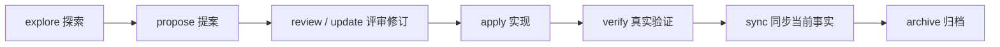

# PixCode 中文使用手册

> 当前版本：PixCode `0.1.0`  
> 内置引擎：OpenSpec `1.6.0`  
> 更新日期：2026-07-27

先按本手册完成安装和项目初始化；准备交付业务功能时，再使用[功能交付示例：设备巡检任务](功能交付示例-设备巡检任务.md)完整走一遍工作流。

## 1. PixCode 是什么

PixCode 是面向 AI 编程的轻量工程驱动框架。它把工作分成两类：

- 确定性工作：初始化、状态查询、结构校验、归档检查、Agent 宿主适配，由 `.pixcode/cli/` 中的脚本完成。
- 语义性工作：需求澄清、规格编写、设计取舍、代码实现、测试推导，由 Agent 按 rules、skills、Schema 和项目代码完成。

OpenSpec 作为 PixCode 的内部依赖，负责 change、delta spec、任务跟踪、当前事实和归档。用户只使用 PixCode，不需要全局安装或直接学习 OpenSpec 命令。

## 2. 安装

创建一个干净目录并克隆 PixCode：

```powershell
New-Item -ItemType Directory C:\Work\PixCode-Workspace -Force
Set-Location C:\Work\PixCode-Workspace
git clone <PixCode仓库地址> <项目目录>
Set-Location <项目目录>
```

确认这是干净副本：

```powershell
git status --short
Test-Path package-lock.json
Test-Path node_modules
```

预期 Git 工作区干净、锁文件存在且 `node_modules` 尚不存在。发行版不应携带框架开发者遗留的活动 change。

按照锁文件安装并检查：

```powershell
npm ci
npm run --silent pixcode -- doctor
npm test
npm run --silent pixcode -- validate --all
```

`npm ci` 严格按照 `package-lock.json` 安装项目本地依赖。PixCode 调用本项目 `node_modules` 中锁定版本的 OpenSpec，不读取全局 PATH。

最低 Node.js 版本为 `20.20.0`。`doctor` 会检查：

- Node.js 版本；
- 本地 OpenSpec 包、版本和可执行入口；
- `.pixcode`、OpenSpec 配置和默认 Schema；
- PixCode Skill 的基本结构；
- `src/` Target 根目录；
- 已安装的 Agent 宿主适配。

## 3. 初始化和 Agent 适配

### 3.1 初始化

```powershell
npm run --silent pixcode -- init --agent codex
```

`--agent` 可选：

- `codex`
- `claude`
- `opencode`
- `none`

初始化是幂等的：已有 OpenSpec 配置不会被覆盖。完成后会执行环境诊断。

### 3.2 安装或刷新宿主 Skill

```powershell
npm run --silent pixcode -- adapters install codex
npm run --silent pixcode -- adapters list
npm run --silent pixcode -- adapters refresh
```

PixCode 将 `.pixcode/skills/pixcode-*` 复制到宿主约定的 Skill 目录：

| 宿主 | 生成位置 |
| --- | --- |
| Codex | `.codex/skills/pixcode-*` |
| Claude Code | `.claude/skills/pixcode-*` |
| OpenCode | `.opencode/skills/pixcode-*` |

每个副本都包含 `.pixcode-managed.json`，记录来源、框架版本和内容摘要。PixCode 只覆盖带此标记的目录；如果同名目录由用户维护，安装会停止并保留原内容。

`.pixcode/skills/` 始终是唯一源码。修改 Skill 后执行 `adapters refresh`，不要在宿主目录中双向维护。

安装或刷新适配后应重启 Agent 宿主。如果宿主仍未显示 Skill，可以让 Agent 直接读取：

```text
.pixcode/skills/pixcode-workflow/SKILL.md
.pixcode/skills/pixcode-verify-delivery/SKILL.md
```

### 3.3 接入业务 Target

PixCode 根仓库跟踪 `src/README.md`，但不携带业务代码。根据当前项目需要，把独立业务仓库克隆到 `src/`：

```powershell
git clone <后端仓库地址> src/backend
git clone <管理Web仓库地址> src/frontend-web
```

分别检查：

```powershell
git -C src/backend status --short
git -C src/frontend-web status --short
git -C src/backend branch --show-current
git -C src/frontend-web branch --show-current
```

每个 `src/<target>/` 都是独立 Git 边界，分别维护分支、提交、构建和测试。只接入当前项目真实存在的 Target，不要为了套用示例虚构目录。

## 4. 什么时候使用 SPEC

默认直接处理：

- 解释、调查和缺陷定位；
- 恢复既有预期行为的缺陷修复；
- 不改变业务语义的局部重构；
- 构建、日志、依赖和开发工具调整；
- 不改变共享契约、领域规则、权限、状态或持久化模型的实现调整。

显式进入规格流程：

- 用户调用 `$pixcode-workflow propose`；
- 用户明确要求创建、维护、实现或归档某个 change；
- 需要完整评审、多端协作、测试交接或验收留痕；
- 需要改变业务规则、模型、权限、状态流程或跨 Target 契约。

调查中发现必须改变共享语义时，Agent 先说明原因并请求确认，不自动创建 SPEC。

## 5. 工作流



### 5.1 探索

```text
$pixcode-workflow explore 讨论库房移动端离线盘点的边界和风险
```

探索只调查和澄清，不创建 change、不修改代码。

### 5.2 创建变更

推荐向 Agent 提供模块、功能、Change、Target 和范围：

```text
$pixcode-workflow propose

为库房模块增加移动端离线盘点。
模块：库房管理（warehouse）
功能：离线盘点（offline-inventory）
Change：warehouse-offline-inventory
Target：backend、warehouse-mobile
包含：任务领取、扫码盘点、冲突检测和同步。
不包含：库位调整和盘盈盘亏审批。
```

Agent 会先执行：

```powershell
npm run --silent pixcode -- change create warehouse-offline-inventory
```

随后按 `openspec/schemas/pixcode-delivery/schema.yaml` 的依赖顺序和中文模板生成资产，并执行：

```powershell
npm run --silent pixcode -- validate warehouse-offline-inventory
```

### 5.3 评审与修订

建议按以下顺序评审：

1. `proposal.md`：问题、范围、Capability 和 Target。
2. `specs/*/spec.md`：可观察需求和 Scenario。
3. `design/model.md`：模型、状态、不变量和持久化影响。
4. `design/process.md`：主流程、失败路径和补偿。
5. `design/contracts.md`：提供方、消费者、兼容与错误语义。
6. `test/test-plan.md`：测试层级、环境、数据和证据。
7. `tasks.md`：按 Target 拆分且可追溯的实现任务。

修订入口：

```text
$pixcode-workflow update warehouse-offline-inventory
```

Agent 应把新决定同步到全部受影响资产，并重新严格校验；不能只改一份文档留下冲突。

### 5.4 实现

```text
$pixcode-workflow apply warehouse-offline-inventory
```

实现时：

- 读取 change 的全部规划资产；
- 按 `tasks.md` 的依赖顺序推进；
- 分别进入 `src/<target>/` 独立仓库读取规则、检查状态、修改和验证；
- 完成任务后勾选对应任务；
- 不用代码猜测替代缺失的业务决定；
- 如需改变已确认业务语义，停止实现并先修订 change。

### 5.5 验证

```text
$pixcode-verify-delivery warehouse-offline-inventory
```

验证 Skill 从 Requirement、Scenario、Target 和 `test/test-plan.md` 推导真实测试：

- 单 Target 单元、组件或 API 验证；
- 前端页面和交互自动化；
- 契约、集成与端到端验证；
- 环境、资源角色和数据特征绑定；
- 命令、时间、退出码、关键输出与证据索引。

大型证据放在：

```text
openspec/changes/<change>/evidence/<target>/<run-id>/
```

只记录真实执行结果；不得把未执行项目写成通过，不得保存密码、Token、生产数据或其他秘密。

### 5.6 同步与归档

同步把 delta spec 合并为 `openspec/specs/` 当前事实，但保留活动 change：

```text
$pixcode-workflow sync warehouse-offline-inventory
```

归档入口：

```text
$pixcode-workflow archive warehouse-offline-inventory
```

底层确定性命令：

```powershell
npm run --silent pixcode -- archive warehouse-offline-inventory
```

归档前默认检查：

- `tasks.md` 不存在未勾选任务；
- `verification.md` 已存在且结论不是“不通过”；
- change 通过严格校验。

需求不可原地回退。若要撤销已生效需求，创建一个新的 change 描述反向业务变化。

## 6. 资产与命名

机器目录使用小写 `kebab-case`：

- Capability：`<module-id>-<feature-id>`
- 首次 Change：`<module-id>-<feature-id>`
- 后续并行 Change：`<module-id>-<feature-id>-<change-topic>`

示例：

```text
supply-general-approval
supply-general-approval-add-delegation
warehouse-offline-inventory
```

不要使用中文目录、空格、下划线、大写字母，也不要添加没有检索价值的 `establish`、`add`、`update` 前缀。

每份资产的中文标题和元数据应包含模块、功能、Change、Capability 与 Target。目录负责机器处理，中文内容负责人类检索和评审。

## 7. 标准资产

| 资产 | 核心问题 |
| --- | --- |
| `proposal.md` | 为什么做、包含什么、影响哪些 Target |
| `specs/**/*.md` | 系统完成后必须表现出什么行为 |
| `design/model.md` | 数据、关系、状态与不变量 |
| `design/process.md` | 参与者如何流转，失败如何处理 |
| `design/contracts.md` | API、事件、错误与兼容边界 |
| `test/test-plan.md` | 测什么、在哪测、需要什么数据 |
| `tasks.md` | 各 Target 按什么顺序实现 |
| `verification.md` | 实际执行结果、证据与遗留风险 |

模型、流程或契约不适用时保留模板，并写明“不适用”及判断依据。

## 8. CLI 参考

```text
pixcode init [--agent codex|claude|opencode|none]
pixcode doctor [--json]
pixcode validate [change|--all] [--json]
pixcode change create <change-id> [--json]
pixcode status [change] [--json]
pixcode archive <change> [--yes] [--json]
pixcode adapters install <codex|claude|opencode>
pixcode adapters refresh
pixcode adapters list [--json]
```

实际调用统一加项目入口：

```powershell
npm run --silent pixcode -- <命令>
```

`--json` 用于 Agent 或脚本读取结构化结果。`archive --yes` 只允许用户明确接受未完成任务或缺失验证的例外，不能绕过严格结构校验。

## 9. 开发与升级

运行框架测试：

```powershell
npm test
npm run --silent pixcode -- doctor
npm run --silent pixcode -- validate --all
```

升级内部 OpenSpec 时同时修改：

1. `package.json` 中的精确版本；
2. `.pixcode/pixcode.json` 中的期望版本；
3. `package-lock.json`；
4. 本手册的版本说明。

升级后必须执行 CLI 测试、Schema 校验和至少一次 change 冒烟流程。当前脚本分发阶段不提供 `pixcode update`，框架源码通过 Git 更新，依赖通过 `npm ci` 复现。

## 10. 常见问题

### 提示未安装 OpenSpec

在项目根目录执行：

```powershell
npm ci
```

不要用全局安装规避版本检查。

### Agent 看不到 PixCode Skill

为对应宿主安装适配并重启宿主：

```powershell
npm run --silent pixcode -- adapters install codex
```

也可以直接让 Agent 读取 `.pixcode/skills/` 下对应的 `SKILL.md`。

### 同名 Skill 未被覆盖

目标目录没有 `.pixcode-managed.json`，因此被视为用户资产。先人工确认来源；不要通过删除标记或强制复制绕过保护。

### 校验失败

```powershell
npm run --silent pixcode -- validate <change> --json
```

分别查看 Skill、Schema 与 change 三部分结果。修复资产结构或内容后重新执行。
