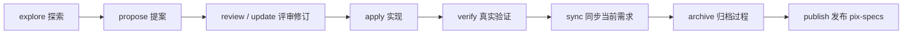

# PixCode 中文使用手册

> 当前版本：PixCode `0.7.2`
> 内置引擎：OpenSpec `1.6.0`  
> 更新日期：2026-07-28

先按本手册完成安装和项目初始化；准备交付业务功能时，再使用[功能交付示例：设备巡检任务](功能交付示例-设备巡检任务.md)完整走一遍工作流。

## 1. PixCode 是什么

PixCode 是面向 AI 编程的轻量工程驱动框架。它把工作分成两类：

- 确定性工作：初始化、状态查询、结构校验、归档检查、Agent 宿主适配，由 `.pixcode/cli/` 中的脚本完成。
- 语义性工作：需求澄清、规格编写、设计取舍、代码实现、测试推导，由 Agent 按 rules、skills、Schema 和项目代码完成。

OpenSpec 作为 PixCode 的内部依赖，负责 change、delta spec、任务跟踪、当前需求事实和归档。PixCode 在归档后把有效结论合并发布到根目录 `pix-specs/`，形成便于评审、协作和交接的当前完整功能规格。用户只使用 PixCode，不需要全局安装或直接学习 OpenSpec 命令。

## 2. 安装

在业务仓库根目录把 PixCode 接为 Submodule：

```powershell
git init
git submodule add https://github.com/BruceSongCN/PixCode.git .pixcode
npm ci --prefix .pixcode
```

从空目录创建工作区身份、`src/`、安全的 `.gitignore` 和最小 npm 命令入口：

```powershell
node .pixcode/cli/pixcode.mjs workspace init --name <workspace-name>
```

然后检查框架版本：

```powershell
npm run --silent pixcode -- version
```

`npm ci --prefix .pixcode` 严格按照 `.pixcode/package-lock.json` 安装框架自有依赖。PixCode 只调用 `.pixcode/node_modules` 中锁定版本的 OpenSpec，不读取全局 PATH，也不依赖宿主根目录恰好安装了什么包。此时可以还没有 `openspec/`；它将在下一步初始化时生成。

最低 Node.js 版本为 `20.20.0`。`doctor` 会检查：

- Node.js 版本；
- PixCode 自有 OpenSpec 包、版本和可执行入口；
- `.pixcode`、OpenSpec 配置和默认 Schema；
- `manifest.json` 的 JSON Schema 结构；
- PixCode Skill 的基本结构；
- `src/` Target 根目录；
- 已安装 Agent 宿主适配是否与框架源码一致。

## 3. 初始化和 Agent 适配

### 3.1 初始化

```powershell
npm run --silent pixcode -- init --agent codex
```

`--agent` 可选：

- `codex`
- `claude`
- `opencode`
- `none`

初始化是幂等的：已有 OpenSpec 项目配置不会被覆盖；同名 Schema 只有带 PixCode 管理标记时才会刷新，用户自有目录会被拒绝覆盖。完成后会执行环境诊断。

初始化完成后执行完整检查：

```powershell
npm run --silent pixcode -- doctor
npm test --prefix .pixcode
npm run --silent pixcode -- validate --all
```

PixCode 框架中的初始化源位于：

```text
.pixcode/scaffolds/openspec/
├─ config.yaml
└─ schemas/pixcode-delivery/
```

纯框架仓库不需要预置根目录 `openspec/`。首次执行 `pixcode init` 时会生成：

```text
openspec/
├─ config.yaml
└─ schemas/pixcode-delivery/
```

再次执行初始化时保留项目已经维护的 `openspec/config.yaml`，刷新由 PixCode 管理的默认 Schema。后续产生的 `changes/`、`specs/` 和归档全部属于当前项目，不属于 PixCode 框架源码。

### 3.2 安装或刷新宿主 Skill

```powershell
npm run --silent pixcode -- adapters install codex
npm run --silent pixcode -- adapters list
npm run --silent pixcode -- adapters refresh
```

PixCode 将 `.pixcode/skills/pixcode-*` 复制到宿主约定的 Skill 目录：

| 宿主 | 生成位置 |
| --- | --- |
| Codex | `.codex/skills/pixcode-*` |
| Claude Code | `.claude/skills/pixcode-*` |
| OpenCode | `.opencode/skills/pixcode-*` |

每个副本都包含 `.pixcode-managed.json`，记录来源、框架版本和内容摘要。PixCode 只覆盖带此标记的目录；如果同名目录由用户维护，安装会停止并保留原内容。

`.pixcode/skills/` 始终是唯一源码。修改 Skill 后执行 `adapters refresh`，不要在宿主目录中双向维护。

安装或刷新适配后应重启 Agent 宿主。如果宿主仍未显示 Skill，可以让 Agent 直接读取：

```text
.pixcode/skills/pixcode-workflow/SKILL.md
.pixcode/skills/pixcode-verify-delivery/SKILL.md
```

### 3.3 接入业务 Target

PixCode 根仓库跟踪 `src/README.md`，但不携带业务代码。根据当前项目需要，把独立业务仓库克隆到 `src/`：

```powershell
git clone <后端仓库地址> src/backend
git clone <管理Web仓库地址> src/frontend-web
```

分别检查：

```powershell
git -C src/backend status --short
git -C src/frontend-web status --short
git -C src/backend branch --show-current
git -C src/frontend-web branch --show-current
```

每个 `src/<target>/` 都是独立 Git 边界，分别维护分支、提交、构建和测试。只接入当前项目真实存在的 Target，不要为了套用示例虚构目录。

### 3.4 个人本地与远程调试配置

团队共享事实保存在 `manifest.json`；每位开发者的执行环境选择保存在根目录 `workspace.local.json`。后者必须由 Git 忽略，文件不存在时固定默认为 `local`。

```json
{
  "$schema": "./.pixcode/schemas/workspace-local.schema.json",
  "schemaVersion": 1,
  "debug": {
    "mode": "remote",
    "fallback": "disabled",
    "remote": {
      "transport": "ssh",
      "host": "project-dev",
      "workspace": "/srv/project/workspaces/default",
      "runtime": "docker-compose",
      "connectTimeoutSeconds": 3
    }
  }
}
```

连接身份、密钥、端口和实际 IP 优先放入个人 `~/.ssh/config`，`host` 只写 SSH 别名。配置不得包含密码或 Token。共享 `doctor`、`validate`、SPEC 和 CI 不读取该文件。

```powershell
npm run --silent pixcode -- debug status
npm run --silent pixcode -- debug use local
npm run --silent pixcode -- debug use remote
npm run --silent pixcode -- debug doctor
npm run --silent pixcode -- debug gate apply
npm run --silent pixcode -- debug gate verify
```

优先级为 `--mode`、`PIXCODE_DEBUG_MODE`、`workspace.local.json`、默认 `local`。项目通过 `verification.defaultProfiles.local/remote` 为两种模式分别设置安全默认值，`debug use` 会同步个人 Profile。远程不可用时明确失败，不静默改为本地执行。临时模式覆盖与个人 Profile 冲突时，优先改用该模式的项目默认 Profile；不存在时才进入无 Profile 的安全模式。

`status` 只解析配置，`doctor` 只做只读连通性和 Runtime 诊断；`gate apply|verify` 则把执行模式转换成实现或验证阶段的强制边界。`remote` 表示部署后的调试、迁移、集成和真实服务验证必须以配置的远端环境为准，本地程序连接远端数据库不等于远端调试。PixCode 不通用化项目部署命令，也不会自动取得远端写权限；部署入口应由项目规则声明，Agent 只能在用户授权范围内执行。缺少入口或授权时必须暂停，不得用本地结果声称远端完成。

项目还可在 `manifest.json` 声明 `verification.profiles`，把验证模式、数据库隔离方式以及通用环境生命周期命令作为共享事实；个人 `workspace.local.json` 只选择 Profile 和不含凭证的个人端口。Profile 至少声明 `inspection`、`unit`，可声明实现期的 `quick`、`focused`。具体业务测试资产、服务拓扑、迁移断言和用例选择必须来自当前 test-plan，不得固化进全局 Profile。

## 4. 什么时候使用 SPEC

默认直接处理：

- 解释、调查和缺陷定位；
- 恢复既有预期行为的缺陷修复；
- 不改变业务语义的局部重构；
- 构建、日志、依赖和开发工具调整；
- 不改变共享契约、领域规则、权限、状态或持久化模型的实现调整。

显式进入规格流程：

- 用户调用 `$pixcode-workflow propose`；
- 用户明确要求创建、维护、实现或归档某个 change；
- 需要完整评审、多端协作、测试交接或验收留痕；
- 需要改变业务规则、模型、权限、状态流程或跨 Target 契约。

调查中发现必须改变共享语义时，Agent 先说明原因并请求确认，不自动创建 SPEC。

## 5. 工作流



### 5.1 探索

```text
$pixcode-workflow explore 讨论库房移动端离线盘点的边界和风险
```

探索只调查和澄清，不创建 change、不修改代码。

### 5.2 创建变更

推荐向 Agent 提供模块、功能、Change、Target 和范围：

```text
$pixcode-workflow propose

为库房模块增加移动端离线盘点。
模块：库房管理（warehouse）
功能：离线盘点（offline-inventory）
Change：warehouse-offline-inventory
Target：backend、warehouse-mobile
包含：任务领取、扫码盘点、冲突检测和同步。
不包含：库位调整和盘盈盘亏审批。
```

Agent 会先执行：

```powershell
npm run --silent pixcode -- change create warehouse-offline-inventory
```

随后按 `openspec/schemas/pixcode-delivery/schema.yaml` 的依赖顺序和中文模板生成资产，并执行：

```powershell
npm run --silent pixcode -- validate warehouse-offline-inventory
```

Change 根目录中的 `pixcode.yaml` 必须同时声明归档后的功能资产映射：

```yaml
schema_version: 1
capabilities:
  - id: warehouse-offline-inventory
    name: 离线盘点
    action: create
    publication_path:
      - 库房管理
      - 盘点管理
      - 离线盘点
    assets:
      - requirements
      - solution
      - process
      - model
      - contracts
      - interaction
      - test-strategy
      - quality
```

### 5.3 评审与修订

建议按以下顺序评审：

1. `proposal.md`：问题、范围、Capability 和 Target。
2. `specs/*/spec.md`：可观察需求和 Scenario。
3. `design.md`：集中评审功能、流程、模型、API、交互和质量影响。
4. `test-plan.md`：测试层级、环境、数据、自动化边界和证据要求。
5. `review.md`：分维度评审结论、问题、决定和实施准入意见。

综合设计减少了固定文件数量，但没有减少评审维度。`design.md` 中模型、流程、API、交互等章节必须分别给出结论；不适用时说明依据。只有内容复杂到影响阅读时，才在 `design/` 下增加模型、流程、契约或原型附件。

正式评审入口：

```text
$pixcode-workflow review warehouse-offline-inventory
```

`review.md` 初次生成必须保持“待评审”。评审完成后记录：

- 参与角色和日期；
- 各设计维度结论；
- 阻断问题和建议问题；
- 已确认设计决定；
- 有条件通过的条件和关闭方式；
- 是否允许生成 `tasks.md` 并进入实现。

存在未关闭阻断问题时不得进入实现。

修订入口：

```text
$pixcode-workflow update warehouse-offline-inventory
```

Agent 应把新决定同步到全部受影响资产，并重新严格校验；不能只改一份文档留下冲突。

### 5.4 实现

```text
$pixcode-workflow apply warehouse-offline-inventory
```

实现时：

- 首先执行 `npm run --silent pixcode -- debug gate apply --json`；
- 用户明确指定本地或远端时，将该模式传给门禁，不让个人默认配置覆盖本轮意图；
- 读取 change 的全部规划资产；
- 锁定本轮 Target、范围、非目标、数据库权限和外部写操作；
- 先完成最小纵向切片，并立即运行 `quick`、`focused` 或 Target 的等价定向检查；
- 测试与实现相邻推进，最后才执行完整回归和集中整理文档；
- 分别进入 `src/<target>/` 独立仓库读取规则、检查状态、修改和验证；
- 完成任务后勾选对应任务；
- 不用代码猜测替代缺失的业务决定；
- 如需改变已确认业务语义，停止实现并先修订 change。
- remote 模式下，获授权部署并确认真实远端服务是完成运行态调试的必要条件；本地结果只能作为辅助检查。

### 5.5 验证

```text
$pixcode-verify-delivery warehouse-offline-inventory
```

验证 Skill 从 Requirement、Scenario、Target 和 `test-plan.md` 推导真实测试：

- 单 Target 单元、组件或 API 验证；
- 前端页面和交互自动化；
- 契约、集成与端到端验证；
- 环境、资源角色和数据特征绑定；
- 命令、时间、退出码、关键输出与证据索引。

默认按风险执行 `Code Inspection → Unit → Focused Integration → Runtime Smoke → Full Regression`，性能测试按需追加。日常实现默认使用 local 快速反馈；remote 只在 test-plan 明确要求兼容性、跨服务或最终交付确认时进入。`Deploy` 不是每次测试的前置动作，同一实现产物已部署后，测试数据、用例和文档变化只做定向重跑。数据库 reset 默认不重建应用容器，迁移或启动配置变化时才显式重启受影响服务。

写数据库的验证必须先取得用户对目标实例和写操作的明确授权，再通过 Profile 的 `provision/reset/status` 入口准备隔离环境；共享开发实例只允许使用唯一、可追踪、可逆的 fixture，结束时必须核对零残留。控制台仅保留阶段结论和最内层错误，完整日志写入证据文件；`verification.md` 在测试稳定后统一生成。

验证首先执行 `npm run --silent pixcode -- debug gate verify --json`。remote 模式下必须命中远端真实服务，并在 `verification.md` 记录主机/工作区、实际入口、部署标识或版本、OpenAPI 或构建指纹；无法确认部署当前实现时不得判定通过。`pixcode validate` 会确定性检查正向结论是否完整声明这些执行环境事实。

大型证据放在：

```text
openspec/changes/<change>/evidence/<target>/<run-id>/
```

只记录真实执行结果；不得把未执行项目写成通过，不得保存密码、Token、生产数据或其他秘密。

### 5.6 同步与归档

同步把 delta spec 合并为 `openspec/specs/` 当前事实，但保留活动 change：

```text
$pixcode-workflow sync warehouse-offline-inventory
```

归档入口：

```text
$pixcode-workflow archive warehouse-offline-inventory
```

底层确定性命令：

```powershell
npm run --silent pixcode -- archive warehouse-offline-inventory
```

归档前默认检查：

- `tasks.md` 不存在未勾选任务；
- `review.md` 已真实通过且不存在未关闭阻断问题；
- `verification.md` 的验证状态和交付决定均为“通过”或有明确条件的“有条件通过”，且明细中不存在失败、未执行或未验收项；
- change 通过严格校验。
- `pixcode.yaml` 的 Capability、中文路径和受影响资产有效。

需求不可原地回退。若要撤销已生效需求，创建一个新的 change 描述反向业务变化。

OpenSpec 归档成功后，命令会准备 `pix-specs/` 合并计划，但不会用脚本假装理解设计语义。即使 `publication_path` 发生变化，`prepare` 也继续在既有正式目录中完成语义合并，不提前移动功能资产。`pixcode-workflow` 会读取当前 Spec、归档设计和已有结论，把本轮增量合并为当前完整状态，然后执行：

```powershell
npm run --silent pixcode -- capabilities finalize <归档目录名>
npm run --silent pixcode -- capabilities validate
npm run --silent pixcode -- validate --all
```

`finalize` 会先校验所有受影响资产；全部通过后才执行目录改名或移动、写入 `capability.yaml`、生成追溯并重建索引。

如果 OpenSpec 已归档而功能规格发布中断，执行：

```powershell
npm run --silent pixcode -- capabilities prepare <归档目录名>
```

不要重复归档，也不要把最新一轮设计文档直接覆盖既有完整结论。

## 6. 资产与命名

机器目录使用小写 `kebab-case`：

- Capability：`<module-id>-<feature-id>`
- 首次 Change：`<module-id>-<feature-id>`
- 后续并行 Change：`<module-id>-<feature-id>-<change-topic>`

示例：

```text
supply-general-approval
supply-general-approval-add-delegation
warehouse-offline-inventory
```

OpenSpec 的 Change 和 Capability 机器目录不要使用中文、空格、下划线或大写字母，也不要添加没有检索价值的 `establish`、`add`、`update` 前缀。

`pix-specs/` 是例外：它支持任意层级中文目录和中文文件名。每个功能叶子目录用 `capability.yaml` 保存稳定英文 ID，因此中文名称和分类调整不会改变 Capability 身份。

## 7. 标准资产

新版过程资产保持在 Change 根级，减少目录跳转。模型、流程、API 和交互合并为一份综合设计，但在文档内部仍是独立的强制评审维度。根级 `README.md` 只作为导航页。

| 资产 | 核心问题 |
| --- | --- |
| `README.md` | 按阅读顺序导航本轮全部资产及状态 |
| `proposal.md` | 为什么做、包含什么、影响哪些 Target |
| `pixcode.yaml` | 归档后更新哪个 Capability 和哪些当前态资产 |
| `specs/**/*.md` | 系统完成后必须表现出什么行为 |
| `design.md` | 功能、流程、模型、API、交互和质量如何设计 |
| `test-plan.md` | 测什么、在哪测、需要什么数据和自动化 |
| `review.md` | 是否经过正式评审、问题如何处理、能否实施 |
| `tasks.md` | 评审通过后各 Target 按什么顺序实现 |
| `verification.md` | 实际结果、证据、验收偏差和交付决定 |

模型、流程、契约或交互不适用时保留 `design.md` 中对应章节，并写明“不适用”及判断依据。

模型涉及持久化实体时，每个实体必须使用独立字段表，逐字段填写类型、空值、长度、中文说明和来源/规则。`pixcode validate` 会拒绝缺少字段矩阵、字段组合写法和未完成占位符。

### 7.1 当前态功能规格

归档后的当前结论默认位于：

```text
pix-specs/
└─ <中文业务域>/
   └─ <中文子模块>/
      └─ <中文功能>/
         ├─ README.md
         ├─ capability.yaml
         ├─ 010-需求基线.md
         ├─ 020-功能设计.md
         ├─ 030-流程设计.md
         ├─ 040-模型设计.md
         ├─ 050-API与共享契约.md
         ├─ 060-交互设计.md
         ├─ 070-测试策略.md
         ├─ 080-质量与运行约束.md
         └─ 090-变更追溯.md
```

- `openspec/changes/archive/` 回答“每轮为什么改、如何交付和如何验收”。
- `openspec/specs/` 是 OpenSpec 原生的当前需求事实。
- `pix-specs/` 回答“这个功能现在完整是什么样”。
- `010`—`080` 是长期有效结论；每轮验证报告和证据不复制进当前态目录。
- `090`、`capability.yaml` 和各级索引由 PixCode 维护。
- 业务语义修正必须创建新 Change，不直接修改 `pix-specs/`。

## 8. CLI 参考

```text
pixcode workspace init --name <workspace-name> [--json]
pixcode init [--agent codex|claude|opencode|none]
pixcode doctor [--json]
pixcode validate [change|--all] [--json]
pixcode change create <change-id> [--json]
pixcode status [change] [--json]
pixcode archive <change> [--json]
pixcode capabilities prepare <archive> [--json]
pixcode capabilities finalize <archive> [--json]
pixcode capabilities reindex [--json]
pixcode capabilities validate [--json]
pixcode targets list [--json]
pixcode targets status [--json]
pixcode targets bootstrap [--json]
pixcode debug status [--mode local|remote] [--json]
pixcode debug use <local|remote> [--json]
pixcode debug doctor [--mode local|remote] [--json]
pixcode debug gate <apply|verify> [--mode local|remote] [--json]
pixcode adapters install <codex|claude|opencode>
pixcode adapters refresh
pixcode adapters list [--json]
```

实际调用统一加项目入口：

```powershell
npm run --silent pixcode -- <命令>
```

`--json` 用于 Agent 或脚本读取结构化结果。未知参数会直接报错。归档门禁不可通过参数绕过：任务、设计评审和交付验证必须形成明确的正向结论；需求回退应创建新的 Change。

## 9. 开发与升级

运行框架测试：

```powershell
npm test --prefix .pixcode
npm run --silent pixcode -- doctor
npm run --silent pixcode -- validate --all
```

升级内部 OpenSpec 或默认过程 Schema 时同时修改：

1. `.pixcode/package.json` 中的精确版本；
2. `.pixcode/pixcode.json` 中的期望版本；
3. `.pixcode/package-lock.json`；
4. `.pixcode/scaffolds/openspec/`；
5. 本手册和 `CHANGELOG.md` 的版本说明。

升级后必须执行 CLI 测试、Schema 校验和至少一次 change 冒烟流程。当前脚本分发阶段不提供 `pixcode update`，框架源码通过 Git Submodule 更新，依赖通过 `npm ci --prefix .pixcode` 复现。

## 10. 常见问题

### 提示未安装 OpenSpec

在项目根目录执行：

```powershell
npm ci --prefix .pixcode
```

不要用全局安装规避版本检查。

### Agent 看不到 PixCode Skill

为对应宿主安装适配并重启宿主：

```powershell
npm run --silent pixcode -- adapters install codex
```

也可以直接让 Agent 读取 `.pixcode/skills/` 下对应的 `SKILL.md`。

### 同名 Skill 未被覆盖

目标目录没有 `.pixcode-managed.json`，因此被视为用户资产。先人工确认来源；不要通过删除标记或强制复制绕过保护。

### 校验失败

```powershell
npm run --silent pixcode -- validate <change> --json
```

分别查看 Skill、Schema 与 change 三部分结果。修复资产结构或内容后重新执行。
