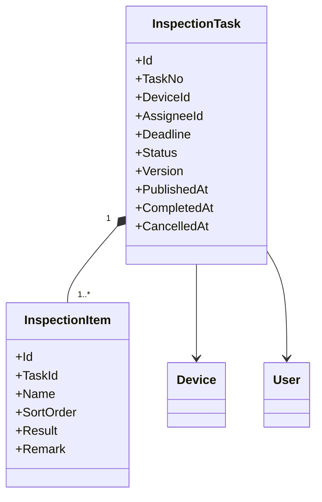
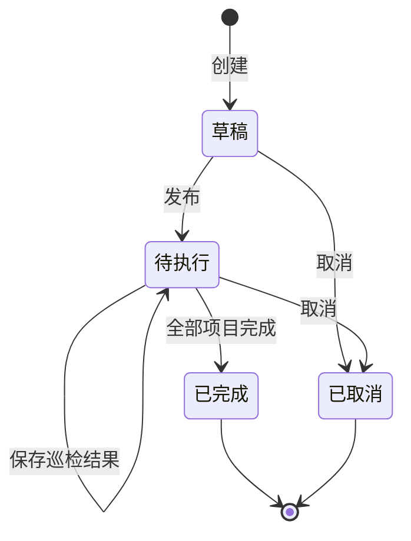
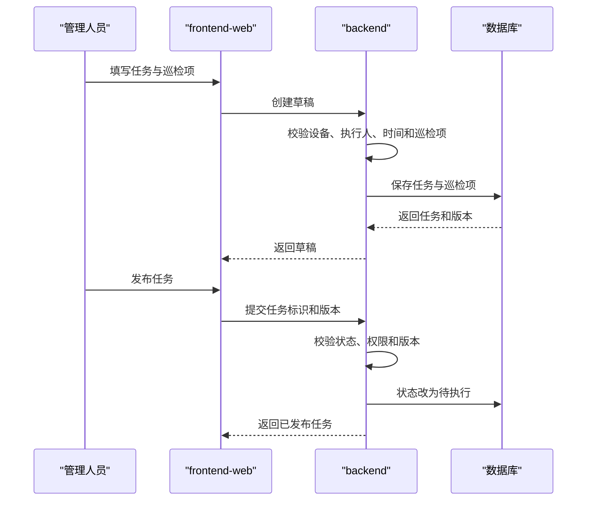
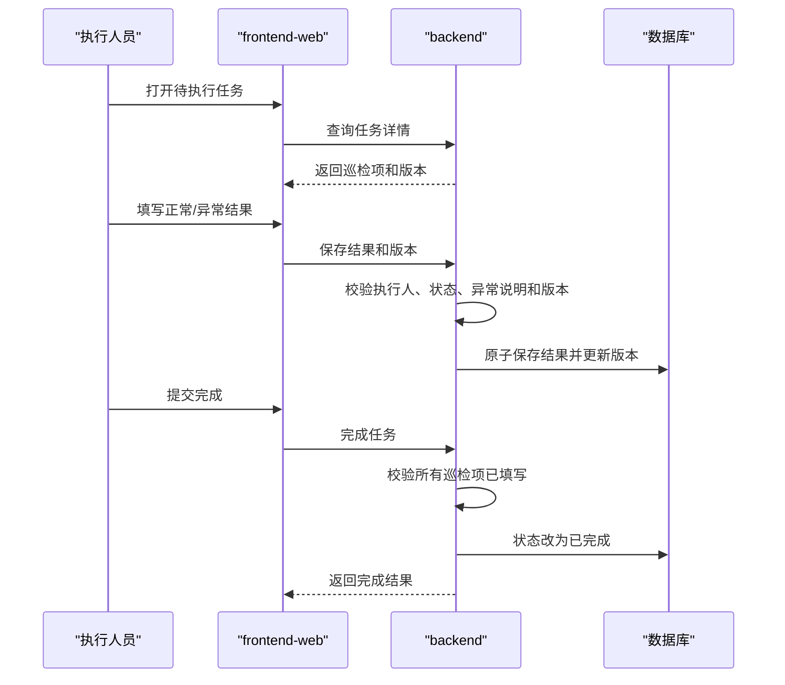

# 功能交付示例：设备巡检任务

本文演示如何使用 PixCode 从零交付一个完整的新功能，而不是给既有页面增加字段。

示例功能：

> 新建设备巡检任务能力。管理人员可以创建并发布巡检任务，执行人员填写各项巡检结果并完成任务，管理人员可以查询全过程。

它会真实涉及：

- 新领域模型和数据库迁移；
- 新状态流程和业务规则；
- 新权限与错误语义；
- 新后端 API；
- 新管理 Web 页面；
- 后端、前端、契约和跨 Target 自动化测试；
- 验证、当前事实同步和归档。

PixCode 的下载、安装、初始化、Agent 适配和 Target 接入统一见[PixCode 中文使用手册](PixCode中文使用手册.md)。本文从功能交付开始。

## 1. 示例身份与交付目标

| 属性 | 示例值 |
| --- | --- |
| 模块 | 设备管理（`device`） |
| 功能 | 巡检任务（`inspection-task`） |
| Change | `device-inspection-task` |
| Capability | `device-inspection-task` |
| Target | `backend`、`frontend-web` |

完成后应得到：

| 交付面 | 结果 |
| --- | --- |
| 当前规格 | `openspec/specs/device-inspection-task/spec.md` |
| 后端 | 模型、迁移、应用服务/API、权限、错误和自动化测试 |
| 管理 Web | 列表、创建、详情、执行交互和自动化测试 |
| 交付证据 | 覆盖 Requirement / Scenario 的真实验证报告 |

本示例使用两个 Target。实际项目如果还涉及巡检移动端，可以新增 `inspection-mobile`，但不能在没有代码库和交付责任时虚构 Target。

## 2. 功能范围

### 2.1 本轮包含

1. 创建巡检任务草稿。
2. 为任务指定设备、执行人、截止时间和一个或多个巡检项。
3. 发布草稿，使任务进入待执行状态。
4. 执行人员逐项填写“正常”或“异常”结果。
5. 异常项必须填写说明。
6. 所有巡检项填写完成后提交任务。
7. 管理人员查询任务列表和详情。
8. 草稿或待执行任务可以取消。
9. 使用数据版本防止并发覆盖。
10. 后端、前端和跨 Target 自动化验证。

### 2.2 本轮不包含

1. 周期性巡检计划和自动生成任务。
2. 离线移动端巡检。
3. 图片、视频和附件上传。
4. 异常后自动生成维修工单。
5. 短信、邮件或站内通知。
6. 批量导入和批量发布。

这些内容不是“以后顺便补”，而是本轮明确的 Out of Scope。需要时应创建新的 change。

## 3. 第一步：确认交付环境

本文假设已按照使用手册完成：

- `npm ci`；
- `pixcode doctor`；
- 当前 Agent 宿主适配；
- `src/backend` 和 `src/frontend-web` 接入。

执行：

```powershell
npm run --silent pixcode -- doctor
npm run --silent pixcode -- status
git status --short
git -C src/backend status --short
git -C src/frontend-web status --short
```

确认：

- PixCode 诊断通过；
- 两个 Target 都可以访问；
- 三个 Git 工作区的已有修改已经识别；
- 不存在同名活动 change；
- 当前分支允许创建功能分支。

分别创建业务分支：

```powershell
git -C src/backend switch -c feature/device-inspection-task
git -C src/frontend-web switch -c feature/device-inspection-task
```

PixCode 根仓库是否创建独立分支，由当前团队协作方式决定。

## 4. 第二步：先探索现状

在创建 SPEC 前，让 Agent 调查真实代码：

```text
使用 $pixcode-workflow explore 调查“设备巡检任务”新功能的落点。

只调查，不创建 change，不修改代码。

请回答：
1. backend 中设备、用户、权限、审计和并发控制的现有实现方式。
2. backend 中新业务实体、数据库迁移、分页查询和业务错误的标准做法。
3. frontend-web 中设备管理的菜单、路由、列表、表单、详情和权限按钮模式。
4. 两个 Target 的构建、最小测试和完整测试命令。
5. 是否已经存在巡检、任务或相似能力，如何避免重复。
6. 实现该功能预计影响哪些模块和共享契约。
```

探索结果至少应说明：

- 新功能应归属的后端模块和前端菜单；
- 可复用的设备、用户、权限和审计能力；
- 是否采用现有乐观并发方案；
- 真实 API 与前端请求风格；
- 测试框架和运行入口；
- 发现的冲突、缺口和待确认问题。

如果仓库已经存在等价能力，不要继续创建重复功能。应改为扩展现有 Capability 或重新定义本轮目标。

## 5. 第三步：创建完整变更提案

向 Agent 输入：

```text
使用 $pixcode-workflow propose 创建“设备巡检任务”完整新功能。

模块：设备管理（device）
功能：巡检任务（inspection-task）
Change：device-inspection-task
Capability：device-inspection-task
Target：backend、frontend-web

业务目标：
管理人员可以创建并发布针对单台设备的巡检任务；
执行人员可以填写所有巡检项并完成任务；
管理人员可以查询任务状态和执行结果。

本轮范围：
1. 创建草稿，指定设备、执行人、截止时间和至少一个巡检项。
2. 发布草稿。
3. 填写每个巡检项的正常或异常结果。
4. 异常项必须填写说明。
5. 所有巡检项完成后提交任务。
6. 草稿或待执行任务可以取消。
7. 查询列表和详情。
8. 使用版本字段防止并发覆盖。
9. 增加对应权限、API、管理页面和自动化测试。

状态：
草稿、待执行、已完成、已取消。

本轮不包含：
周期计划、自动生成任务、离线移动端、附件、异常转维修工单、
消息通知、批量导入和批量发布。

请基于真实代码调查结果，按 pixcode-delivery Schema 生成完整评审资产。
不要修改业务代码，不要伪造 verification.md。
```

Agent 应首先执行：

```powershell
npm run --silent pixcode -- change create device-inspection-task
```

然后按 Schema 依赖生成：

```text
openspec/changes/device-inspection-task/
├─ .openspec.yaml
├─ README.md
├─ proposal.md
├─ specs/
│  └─ device-inspection-task/
│     └─ spec.md
├─ design/
│  ├─ model.md
│  ├─ process.md
│  └─ contracts.md
├─ test/
│  └─ test-plan.md
└─ tasks.md
```

检查：

```powershell
npm run --silent pixcode -- status device-inspection-task --json
npm run --silent pixcode -- validate device-inspection-task
```

结构校验通过只表示资产满足 OpenSpec 规则，不表示业务设计已经获得批准。

## 6. 第四步：评审需求规格

### 6.1 资产身份

每份资产顶部应保持一致：

| 属性 | 期望 |
| --- | --- |
| 标题 | `设备管理｜巡检任务｜<资产类型>` |
| 模块 | 设备管理（`device`） |
| 功能 | 巡检任务（`inspection-task`） |
| Change | `device-inspection-task` |
| Capability | `device-inspection-task` |
| Target | 根据资产写 `backend`、`frontend-web` 或双方 |

### 6.2 核心 Requirement

`specs/device-inspection-task/spec.md` 至少应包含以下需求组。

#### Requirement 1：创建巡检任务草稿

关键 Scenario：

- 成功创建包含一个或多个巡检项的草稿；
- 拒绝不存在或不可用的设备；
- 拒绝不存在或不可用的执行人；
- 拒绝空巡检项；
- 拒绝早于允许范围的截止时间。

示例：

```markdown
### Requirement: 创建巡检任务草稿

系统 SHALL 允许有创建权限的管理人员为一台可用设备创建巡检任务草稿，
并指定执行人、截止时间和至少一个巡检项。

#### Scenario: 成功创建有效草稿

- **WHEN** 管理人员提交可用设备、可用执行人、有效截止时间和至少一个巡检项
- **THEN** 系统创建状态为“草稿”的巡检任务
- **AND** 系统返回任务标识、任务编号和初始数据版本

#### Scenario: 拒绝没有巡检项的草稿

- **WHEN** 管理人员提交不包含巡检项的创建请求
- **THEN** 系统拒绝创建并返回可识别的校验错误
```

#### Requirement 2：发布任务

关键 Scenario：

- 草稿成功发布为待执行；
- 只有草稿可以发布；
- 发布时再次检查设备、执行人和截止时间；
- 版本冲突时拒绝发布。

#### Requirement 3：执行巡检

关键 Scenario：

- 待执行任务可以保存巡检结果；
- 每项结果只能是正常或异常；
- 异常结果必须有说明；
- 非指定执行人不得提交结果；
- 已完成或已取消任务不得继续修改。

#### Requirement 4：完成任务

关键 Scenario：

- 全部巡检项填写后成功完成；
- 存在未填写项时拒绝完成；
- 完成操作原子提交；
- 重复完成不会产生第二次状态变化；
- 版本冲突时不覆盖他人的结果。

#### Requirement 5：取消任务

关键 Scenario：

- 草稿可以取消；
- 待执行任务可以取消；
- 已完成任务不能取消；
- 已取消任务重复取消保持幂等或返回明确错误，必须与项目风格一致。

#### Requirement 6：查询任务

关键 Scenario：

- 按编号、设备、执行人、状态和日期范围分页查询；
- 查看任务详情和全部巡检项；
- 无查看权限时拒绝访问；
- 不存在的任务返回统一业务错误。

### 6.3 规格质量检查

逐项确认：

- Requirement 使用 SHALL 或 MUST；
- 每项都有可执行的 Scenario；
- Scenario 描述可观察行为，而不是类名或方法调用；
- 正常、边界、失败、权限和并发场景均有覆盖；
- Out of Scope 没有悄悄进入 Requirement；
- `inspection-mobile` 没有在未纳入 Target 时被要求实现。

## 7. 第五步：评审模型设计

`design/model.md` 应定义独立的新模型，而不是只增加一个字段。

### 7.1 建议模型



具体名称、主键、审计字段和并发字段应遵守真实代码库规范。

### 7.2 状态模型



评审时必须明确：

- 每个状态允许的命令；
- 状态迁移的权限；
- 状态迁移前置条件；
- 时间和操作人记录；
- 版本冲突处理；
- 取消后是否保留已填写结果；
- 删除策略和审计策略。

### 7.3 不变量

至少定义：

- 一个任务只关联一台设备；
- 一个任务必须且始终至少有一个巡检项；
- 任务编号唯一；
- 待执行后不可随意更换设备和执行人；
- 异常项必须填写说明；
- 未填写完全部项目不得完成；
- 已完成和已取消是终态；
- 并发写入必须校验版本；
- 状态变化、巡检项结果和版本更新必须保持事务一致。

### 7.4 持久化与迁移

评审：

- 新增哪些表、字段、索引和外键；
- 任务编号唯一索引；
- 设备、执行人、状态、截止时间的查询索引；
- 版本字段如何实现；
- 数据库迁移是否可回滚；
- 部署时是否需要停机；
- 空库和已有数据环境是否都能迁移。

## 8. 第六步：评审业务流程

`design/process.md` 应至少包含创建发布和执行完成两条主流程。

### 8.1 创建并发布



### 8.2 执行并完成



还应描述：

- 网络失败后的前端状态；
- 版本冲突后的刷新提示；
- 发布、完成或取消失败时是否允许重试；
- 事务失败时不得出现任务状态与巡检项结果不一致。

## 9. 第七步：评审 API 与共享契约

`design/contracts.md` 应记录稳定语义，并遵守现有项目 API 风格。以下只是语义示例：

| 操作 | 示例契约 | 提供方 | 消费方 |
| --- | --- | --- | --- |
| 创建草稿 | `POST /api/inspection-tasks` | backend | frontend-web |
| 查询列表 | `GET /api/inspection-tasks` | backend | frontend-web |
| 查询详情 | `GET /api/inspection-tasks/{id}` | backend | frontend-web |
| 发布 | `POST /api/inspection-tasks/{id}/publish` | backend | frontend-web |
| 保存结果 | `PUT /api/inspection-tasks/{id}/results` | backend | frontend-web |
| 完成 | `POST /api/inspection-tasks/{id}/complete` | backend | frontend-web |
| 取消 | `POST /api/inspection-tasks/{id}/cancel` | backend | frontend-web |

示例创建请求：

```json
{
  "deviceId": "device-id",
  "assigneeId": "user-id",
  "deadline": "2026-08-01T10:00:00+08:00",
  "items": [
    {
      "name": "检查设备外观",
      "sortOrder": 1
    },
    {
      "name": "检查运行状态",
      "sortOrder": 2
    }
  ]
}
```

示例保存结果请求：

```json
{
  "version": "current-version",
  "items": [
    {
      "itemId": "item-1",
      "result": "normal",
      "remark": null
    },
    {
      "itemId": "item-2",
      "result": "abnormal",
      "remark": "运行时有异常噪声"
    }
  ]
}
```

契约评审必须确认：

- ID、时间、枚举、分页和响应包裹符合现有规范；
- 权限名称与现有授权体系一致；
- 版本字段和冲突错误可被前端可靠识别；
- 业务错误至少覆盖设备不存在、执行人不存在、非法状态、项目未完成和版本冲突；
- 发布顺序为数据库迁移及后端兼容实现优先，前端随后启用；
- 不机械复制完整 OpenAPI，只保留人工评审所需的稳定语义。

## 10. 第八步：评审页面与交互范围

虽然 PixCode 当前没有单独的交互设计 Artifact，前端可观察行为仍必须进入 Requirement、流程、契约、测试方案和 tasks。

管理 Web 至少包含：

### 10.1 任务列表

- 编号、设备、执行人、状态、截止时间；
- 编号、设备、执行人、状态、日期筛选；
- 分页和清空筛选；
- 根据权限显示创建入口；
- 根据状态和权限显示操作。

### 10.2 创建页面

- 选择设备和执行人；
- 设置截止时间；
- 动态增加、删除和排序巡检项；
- 至少保留一个巡检项；
- 保存草稿；
- 显示服务端业务错误。

### 10.3 详情与执行页面

- 显示任务基础信息、状态和版本；
- 草稿状态可以发布或取消；
- 指定执行人在待执行状态填写结果；
- 选择异常时必须填写说明；
- 全部填写后才能提交完成；
- 版本冲突时提示刷新，不覆盖他人数据；
- 终态只读。

Agent 应复用现有组件和交互规范，不能为了新功能引入平行 UI 体系。

## 11. 第九步：评审测试方案

`test/test-plan.md` 应从 Requirement 和 Scenario 推导，而不是从历史测试目录猜测。

### 11.1 测试矩阵

| 范围 | 主要场景 | 层级 | Target |
| --- | --- | --- | --- |
| 创建草稿 | 成功、空项目、无效设备、无效执行人、无效截止时间 | 单元、API | backend |
| 发布 | 成功、非法状态、权限不足、版本冲突 | 单元、API | backend |
| 保存结果 | 正常、异常无说明、非执行人、终态、版本冲突 | 单元、API | backend |
| 完成 | 成功、存在未填写项、重复完成、事务失败 | 单元、API | backend |
| 取消 | 草稿、待执行、已完成、权限不足 | 单元、API | backend |
| 查询 | 筛选、分页、详情、不存在、权限 | API | backend |
| 页面 | 列表、创建、动态巡检项、状态按钮、错误提示 | 组件或浏览器 | frontend-web |
| 跨 Target | 创建、发布、填写结果、完成、查询结果 | 集成/E2E | 双方 |

### 11.2 测试角色与数据

模板只声明资源特征：

| 资源角色 | 所需特征 |
| --- | --- |
| 任务管理人员 | 有创建、发布、取消和查看权限 |
| 巡检执行人员 | 是任务指定执行人，有执行权限 |
| 无权限人员 | 无巡检任务权限 |
| 可用设备 | 当前允许创建巡检任务 |
| 不可用设备 | 用于验证业务拒绝 |

具体账号、设备和数据库由当前环境 Provider 绑定。不得把真实账号、密码或生产数据写进 change。

### 11.3 通过标准

至少包括：

- 两个 Target 的构建和测试通过；
- 所有关键 Scenario 有自动化覆盖或明确人工验证原因；
- API 与前端的版本冲突语义一致；
- 跨 Target 主流程通过；
- 数据库迁移在空库和现有测试库验证；
- 无阻断级失败；
- 未执行项必须进入最终结论。

## 12. 第十步：评审实现任务

`tasks.md` 应体现真实依赖：

```markdown
## 1. 共享契约

- [ ] 1.1 确认状态、不变量、权限、错误和并发契约

## 2. backend 模型与持久化

- [ ] 2.1 实现巡检任务、巡检项和状态模型
- [ ] 2.2 增加数据库迁移、索引和并发字段
- [ ] 2.3 增加领域规则和状态迁移单元测试

## 3. backend API

- [ ] 3.1 实现创建、列表和详情
- [ ] 3.2 实现发布、保存结果、完成和取消
- [ ] 3.3 实现权限、业务错误和 API 自动化测试

## 4. frontend-web

- [ ] 4.1 实现菜单、路由和任务列表
- [ ] 4.2 实现创建页面和动态巡检项
- [ ] 4.3 实现详情、执行、完成和取消交互
- [ ] 4.4 实现权限、错误、版本冲突处理和前端测试

## 5. 联调与收口

- [ ] 5.1 执行迁移和跨 Target 主流程
- [ ] 5.2 执行完整回归并形成验证报告
```

正式 tasks 应进一步关联 Requirement / Scenario 和完成条件。

## 13. 第十一步：人工评审与统一修订

参与者建议包括：

- 产品或业务负责人；
- 后端开发；
- 前端开发；
- 测试；
- 涉及部署时的运维或发布负责人。

重点决策：

- 是否允许待执行任务取消；
- 发布后是否允许修改截止时间；
- 取消时是否保留已填写结果；
- 任务编号规则；
- 异常说明长度；
- 是否需要保存部分结果；
- 并发冲突时的用户体验；
- 权限颗粒度；
- 后端和前端发布顺序。

假设评审决定：

> 待执行任务允许分次保存结果；发布后不允许更换设备和执行人；取消保留已填写结果；异常说明最多 500 字。

向 Agent 输入：

```text
使用 $pixcode-workflow update device-inspection-task。

评审决定：
1. 待执行任务允许分次保存巡检结果。
2. 发布后不允许修改设备和执行人。
3. 取消任务时保留已经填写的巡检结果。
4. 异常说明最大长度为 500。

请统一修订需求、模型、流程、契约、测试方案和 tasks。
不要修改代码。
```

然后执行：

```powershell
npm run --silent pixcode -- validate device-inspection-task
git diff -- openspec/changes/device-inspection-task
```

搜索旧结论，确保不存在资产间冲突。评审批准后才进入实现。

## 14. 第十二步：按规格实现

向 Agent 输入：

```text
使用 $pixcode-workflow apply device-inspection-task。

严格按已批准的 change 和 tasks.md 实现。
分别读取 backend 与 frontend-web 的仓库规则。
保留三个工作区已有修改。
按依赖顺序实现，每完成一项任务就执行对应最小验证并更新任务状态。

如果真实代码迫使我们改变状态、模型、权限或共享 API，
请停止实现并报告需要修订的规格，不要自行改变已确认设计。
```

### 14.1 推荐实现顺序

1. 共享状态、权限、错误和 API DTO。
2. 后端领域模型和状态迁移。
3. 数据库迁移、索引和并发控制。
4. 后端查询与命令 API。
5. 后端单元和 API 测试。
6. 前端菜单、路由和列表。
7. 前端创建、详情和执行页面。
8. 前端组件或浏览器自动化测试。
9. 跨 Target 联调。
10. 完整回归和任务收口。

### 14.2 三个 Git 边界

```powershell
git status --short
git -C src/backend status --short
git -C src/frontend-web status --short
```

| 仓库 | 内容 |
| --- | --- |
| PixCode 根仓库 | change、当前 specs 和交付证据 |
| `src/backend` | 后端模型、迁移、API、权限和测试 |
| `src/frontend-web` | 页面、交互、客户端契约和测试 |

跨仓修改不是原子提交。任何 Target 都不能通过自己的实现单方面改变共享契约。

### 14.3 实现过程中出现设计冲突

例如真实后端已经统一采用事件驱动状态变更，而 proposal 假设同步命令完成。Agent 应：

1. 暂停相关实现；
2. 说明对流程、API、测试和发布的影响；
3. 请求确认；
4. 使用 `$pixcode-workflow update` 修订资产；
5. 重新校验后继续 apply。

不能让代码事实和规格事实分叉。

### 14.4 检查任务进度

```powershell
npm run --silent pixcode -- status device-inspection-task --json
Get-Content openspec/changes/device-inspection-task/tasks.md
```

任务只能在实现和对应最小验证完成后勾选。

## 15. 第十三步：执行真实交付验证

向 Agent 输入：

```text
使用 $pixcode-verify-delivery 验证 device-inspection-task。

要求：
1. 从 Requirement、Scenario、Target 和 test-plan 推导用例。
2. 执行 backend 的模型、状态、权限、API 和迁移测试。
3. 执行 frontend-web 的列表、创建、详情、执行和错误交互测试。
4. 执行创建、发布、分次保存结果、完成和查询的跨 Target 主流程。
5. 执行非法状态、权限不足、异常无说明和版本冲突场景。
6. 记录真实命令、环境、时间、退出码和证据。
7. 失败或未执行项目必须如实进入最终结论。
8. 不使用生产环境，不记录凭证和生产数据。
```

### 15.1 预期验证结构

```text
openspec/changes/device-inspection-task/
├─ verification.md
└─ evidence/
   ├─ backend/
   │  └─ <run-id>/
   ├─ frontend-web/
   │  └─ <run-id>/
   └─ integration/
      └─ <run-id>/
```

### 15.2 Requirement 覆盖

验证报告至少追溯：

| Requirement | 关键证据 |
| --- | --- |
| 创建草稿 | 后端 API 测试、前端创建测试 |
| 发布任务 | 状态测试、API 测试、前端操作测试 |
| 执行巡检 | 结果规则测试、执行页面测试 |
| 完成任务 | 完整性、事务、重复提交和端到端测试 |
| 取消任务 | 状态和权限测试 |
| 查询任务 | 筛选、分页、详情和权限测试 |
| 并发保护 | backend 冲突测试、frontend 刷新提示测试 |

### 15.3 数据库迁移

必须记录：

- 空数据库应用迁移结果；
- 有既有设备数据的测试库应用迁移结果；
- 新表和索引检查；
- 应用启动和基本查询；
- 失败后的恢复方式。

### 15.4 最终校验

```powershell
npm run --silent pixcode -- validate device-inspection-task
git -C src/backend diff --check
git -C src/frontend-web diff --check
```

再执行两个 Target 规则规定的完整交付测试。

`verification.md` 的结论只能是：

- 通过；
- 有条件通过；
- 不通过。

有未执行关键场景或阻断级失败时不能写“通过”。

## 16. 第十四步：验证归档保护

在任务未全部完成或 `verification.md` 不存在时执行：

```powershell
npm run --silent pixcode -- archive device-inspection-task
```

命令必须阻止归档，并指出未完成任务、缺失验证或严格校验错误。

不要通过伪造任务状态或验证结果使归档通过。`--yes` 只用于用户明确接受的流程例外，不能绕过严格结构校验。

## 17. 第十五步：同步当前事实

验证通过后输入：

```text
使用 $pixcode-workflow sync device-inspection-task。

把 delta spec 合并为 device-inspection-task 当前事实。
保留活动 change，不归档。
同步后校验当前 specs 和活动 change。
```

检查：

```powershell
Get-Content openspec/specs/device-inspection-task/spec.md
npm run --silent pixcode -- validate --all
```

当前 spec 应描述系统现在具有的完整巡检任务行为，不再使用 ADDED、MODIFIED 等变更过程标题。

## 18. 第十六步：归档

输入：

```text
使用 $pixcode-workflow archive device-inspection-task。
```

或执行确定性入口：

```powershell
npm run --silent pixcode -- archive device-inspection-task
```

检查：

```powershell
npm run --silent pixcode -- status
npm run --silent pixcode -- validate --all
Get-ChildItem openspec/changes/archive
Get-Content openspec/specs/device-inspection-task/spec.md
```

预期：

- 活动 change 不再包含 `device-inspection-task`；
- change 已进入归档；
- 当前 spec 保留最终有效需求；
- 验证报告和证据索引可追溯；
- 所有严格校验通过。

需求不可原地回退。未来移除或改变巡检任务行为时，应创建新的 change。

## 19. 第十七步：提交与发布交接

### 19.1 提交前检查

```powershell
git status --short
git -C src/backend status --short
git -C src/frontend-web status --short
```

分别审查差异和暂存区，禁止直接用 `git add .` 带入无关文件或秘密。

### 19.2 分别提交

```powershell
git -C src/backend add <确认后的后端文件>
git -C src/backend commit -m "feat(device): add inspection tasks"

git -C src/frontend-web add <确认后的前端文件>
git -C src/frontend-web commit -m "feat(device): deliver inspection task workflow"

git add <确认后的规格与归档文件>
git commit -m "docs(device): archive inspection task delivery"
```

### 19.3 发布顺序

建议：

1. 备份并验证数据库迁移条件；
2. 应用数据库迁移；
3. 发布兼容的 backend；
4. 执行 backend 冒烟测试；
5. 发布 frontend-web；
6. 执行跨 Target 主流程；
7. 观察错误、性能和数据库指标。

实际顺序以 contracts 和项目发布规范为准。

### 19.4 交接内容

| 内容 | 来源 |
| --- | --- |
| 当前需求和验收场景 | `openspec/specs/device-inspection-task/spec.md` |
| 模型、流程和契约决策 | 归档 change |
| 后端代码与测试 | backend commit / PR |
| 前端代码与测试 | frontend-web commit / PR |
| 实际验证结果 | `verification.md` |
| 证据 | verification 中的 evidence 索引 |
| 风险和未执行项 | verification 的失败与遗留风险 |
| 发布顺序 | contracts 和交接说明 |

接收人员不需要重新阅读 Agent 对话才能理解交付。

## 20. 完整新功能验收清单

### 规格与设计

- [ ] 新 Capability 独立且没有重复已有能力。
- [ ] proposal 的范围、Target 和影响清楚。
- [ ] Requirement 覆盖正常、失败、权限、状态和并发。
- [ ] 模型定义实体、关系、状态、不变量和迁移。
- [ ] 流程覆盖创建、发布、执行、完成、取消和异常。
- [ ] API 定义提供方、消费者、错误、并发和发布顺序。
- [ ] 测试方案可追溯到 Requirement / Scenario。
- [ ] tasks 按依赖和 Target 拆分。

### backend

- [ ] 新模型和迁移符合项目规范。
- [ ] 状态迁移和不变量集中执行。
- [ ] 权限与业务错误完整。
- [ ] 乐观并发能够阻止覆盖。
- [ ] 查询、命令和事务行为通过自动化测试。
- [ ] 空库和现有测试库迁移通过。

### frontend-web

- [ ] 列表、筛选和分页可用。
- [ ] 创建页面支持动态巡检项。
- [ ] 详情页面根据状态和权限展示操作。
- [ ] 异常说明、未完成项和业务错误有明确反馈。
- [ ] 版本冲突不会静默覆盖。
- [ ] 关键交互有自动化测试。

### 验证与交接

- [ ] 跨 Target 主流程真实执行通过。
- [ ] 失败和未执行项没有隐藏。
- [ ] verification 能追溯到 Requirement 和证据。
- [ ] 未提交凭证、生产数据和大型运行产物。
- [ ] 当前 spec 表达最终有效行为。
- [ ] change 已归档。
- [ ] 三个仓库的提交和发布顺序清楚。

## 21. 常见偏差

### Agent 把它做成设备实体上的几个字段

这是错误方向。巡检任务有独立生命周期、巡检项、执行人、权限和审计，应形成独立 Capability 和模型。

### 只生成 API，没有完整状态规则

先修订 spec、model 和 process。发布、完成、取消及并发不是控制器实现细节，而是业务行为。

### 前端只实现表单，没有失败和权限场景

Requirement、测试方案和 tasks 必须覆盖权限不足、非法状态、异常无说明、未完成项和版本冲突。

### 测试只跑了编译

编译不能证明业务行为。至少执行领域规则、API、前端交互、数据库迁移和跨 Target 主流程测试。

### 为了归档把未执行项写成通过

这是不可接受的。记录“未执行”、原因和影响，结论写“有条件通过”或“不通过”。

### 上线后需要撤销

创建新的反向 change，明确数据库数据、API 兼容、页面下线和发布顺序，不改写归档历史。
